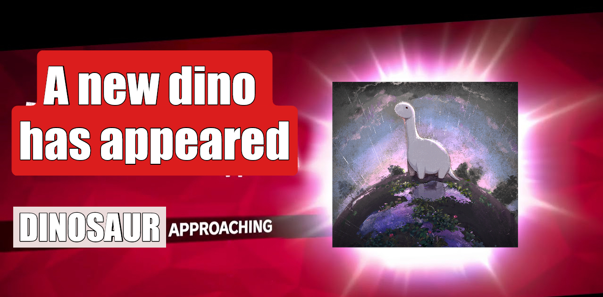

# Scripting with Deno

A really cool capability of `artemis` is it contains an embedded `JavaScript`
runtime via [Deno](https://deno.land/). Deno is V8 based `JavaScript` runtime
written in Rust. By importing the `deno_core` crates this allows us to create
our own `JavaScript` runtime geared specifically for forensics and IR!

For example, the Rust `artemis` function `get_registry(registry_file_path)` can
be used to parse a provided `Registry` file on disk. By registering this
function with the Deno runtime we can call this function directly from
`JavaScript`! In addition to `JavaScript`,
[TypeScript](https://www.typescriptlang.org/) is also supported by Deno!\
To summarize:

1. We can create a script using `TypeScript` and `Deno`
2. Compile `TypeScript` to `JavaScript`
3. Execute `JavaScript` using `artemis`

`Deno image from https://deno.land/artwork. The image is MIT licensed. Checkout other artwork by the author at https://hashrock.studio.site/`

# Prequisites for Scripting.

1. [Deno](https://deno.land/)
2. A text-editor or IDE that supports Deno. [VSCodium](https://vscodium.com/)
   and [VSCode](https://code.visualstudio.com/) have been tested
3. Deno language server extension. The extension in the VSCodium and VSCode
   marketplaces has been tested.
4. A `TypeScript` to `JavaScript` bundler. There are multiple options:
   - `Deno` includes a builtin bundler however it is schedule for depreciation.
     (But it still works)
   - [esbuild Deno loader](https://deno.land/x/esbuild_deno_loader@0.6.0). Will
     require a simple build script in order to bundle our `artemis` script
